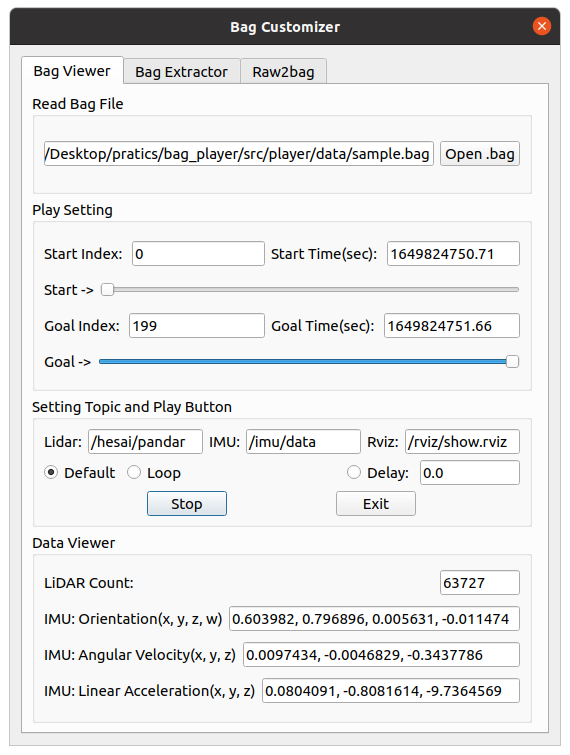
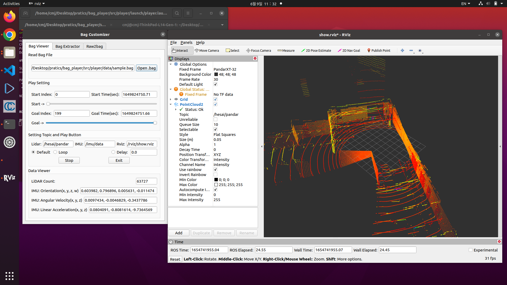
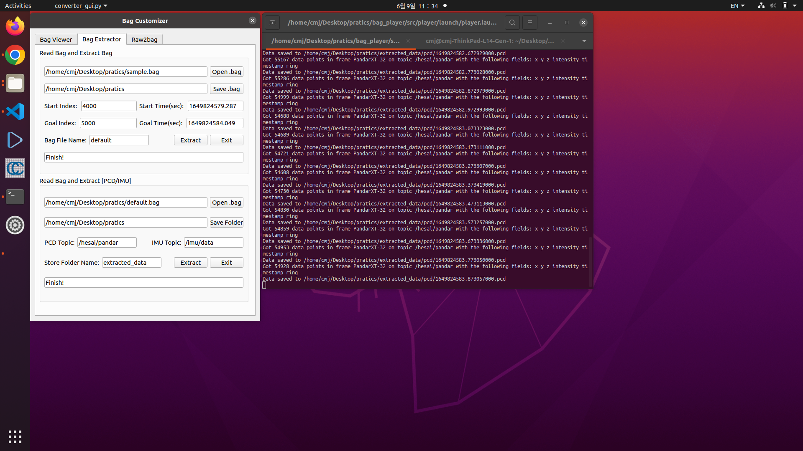
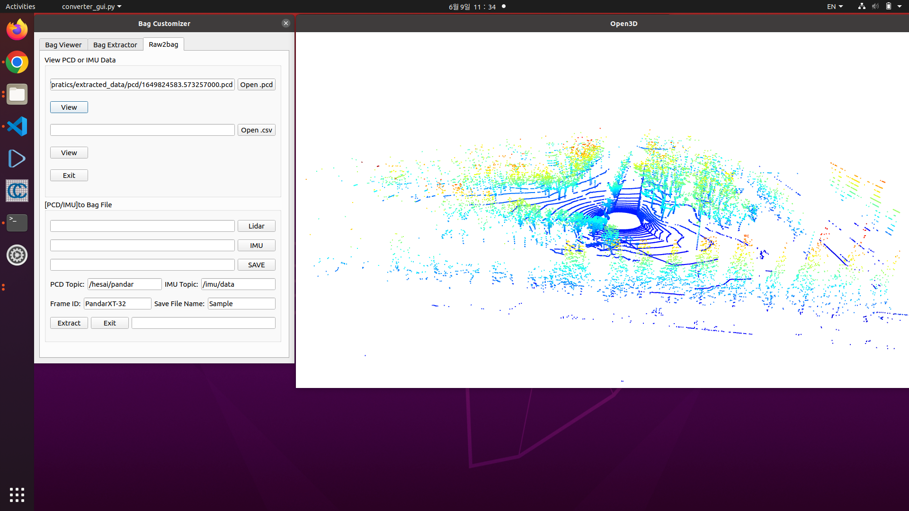
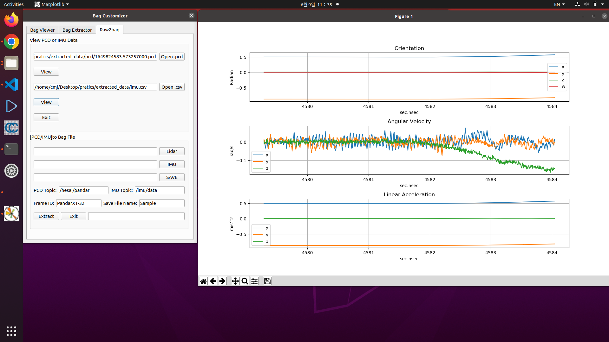

## ROSBAG Customizer [For User]
---
자율주행차량이나 MMS 장비 등에 장착되어 있는 각 센서를 사용하는 연구개발자 분들을 위한 GUI Tool입니다.

Ubuntu + ROS 환경에서 센서 데이터를 손 쉽게 Read & Write 할 수 있도록 만든 GUI라고 보시면 됩니다.

<p align="center">
    
</p>

---
### 특징
#### 1. bag 파일 쉽게 Viewer 기능
#### 2. bag2bag or bag2rawdata 추출 기능
#### 3. rawdata viewer & rawdata2bag 병합 기능

---
### 시작 전 필수 다운로드 & 설정
```bash
$> sudo apt install ros-noetic-desktop-full
$> sudo apt install rviz
$> sudo apt install python3 # 본 GUI는 python3를 기반으로 동작함
$> sudo apt install python-rosbag
```

```bash
$> pip install open3d
$> pip install pyqt5
$> pip install pyqt5-tools
or
$> pip3 install open3d
$> pip3 install pyqt5
$> pip3 install pyqt5-tools
```

만약 Window 10 이상의 환경에서 WSL2로 Ubuntu를 쓴다면 rviz할때 segmentation Fault 에러가 날 수 있음 

이것을 방지하기 위해서는 아래 명령어 입력
```bash
$> export LIBGL_ALWAYS_INDIRECT=0
```

---
---
### 실행 방법

1. git에서 이 코드 다운받은 후 package를 build
```bash
$> git clone https://github.com/kangminsu1/Rosbag_converter.git
$> cd Rosbag_converter
$> catkin_make
```

2. bag player 실행
```bash
$> source devel/setup.bash
$> roslaunch player player.launch
```

3. 만약 ERROR: cannot launch node of type [player/converter_gui.py]...(chmod +x) 이 뜬다면
```bash
$> chmod +x src/player/scripts/*.py
$> chmod +x src/player/src/*.py
이후
$> roslaunch player player.launch
```

---
---
### 기능 설명
### Tab1: Bag Viewer
1. Read bag file -> bag 파일 불러오기 (불러오면 Play Setting 부에서 자동으로 start time, Goa time setting됨)
2. Play Setting -> Start & Goal index로 시작 지점과 끝낼 지점 세팅 가능하며, Progressbar(Start->, Goal->) 마우스로 설정 가능
- Time은 timestamp임
3. Setting Topic and Play Buttun -> Bag 파일 내에 저장된 Topic을 읽어와서 설정해야 함 (default: Sample.bag 파일 Topic)
- bag 파일 Topic 불러오는 방법
```bash
$> rosbag info 파일명.bag # Rosbag_converter/src/player/data 폴더에 sample.bag 파일 있음
```
- 이렇게하면 bag의 상세 내용이 나오는데 맨 아래 Topic의 첫번째 내용을 복사에서 Setting Topic에 기입하면 됨
4. Rviz -> Sample.bag 파일 말고 다른 파일이면 Start 버튼 실행 후 나오는 RViz 수동으로 설정하여야 함 (bag 정보 입력. bag 정보는 위 3번 참조)
- 바꿔야할 내용
- 1. Fixed Frame
- 2. PointCloud2 -> Topic
- 바꾼 후 동일한 rviz 경로에 저장
- 이후 Tab1의 Stop 버튼 누른 후 다시 Start 하면 나옴
5. Default: 기본, Loop: bag 파일 무한 재생, Delay: n초 이후 재생하도록 설정
6. Data Veiwer: Lidar의 Point 개수와 IMU 정보 나옴

<p align="center">
    
</p>

### Tab2: Bag Extractor
1. Read & Save: 불러올 bag 파일과 저장할 경로 설정
2. Play Setting: 추출할 지점을 Start, Goal index로 설정
3. Bag File Name: 저장할 파일 이름 (자동으로 .bag이 설정됨. 그냥 파일 이름만 적기)
4. PCD & IMU Topic: 추출할 bag의 sensor Topic (이것도 Tab1의 3번 설명을 참조 후 입력)
5. Store Folder Name: 저장할 폴더 이름 설정 (설정한 폴더 안에 pcd 데이터 담은 폴더와 imu.csv가 생성됨)
6. Extract버튼 누르고 기다리면 하단에 Finish!가 생김. 그러면 추출 완료

<p align="center">
    
</p>

### Tab3: Raw2bag
1. View PCD or IMU Data: 추출된 각 센서 데이터 Viewer
- pcd 파일 불러온 후 View 누르면 open3d gui 생성됨 (끄는 방법은 'q' 입력)
- imu.csv 파일 불러온 후 View 누르면 plot 그래프 생성됨

2. [PCD/IMU]to Bag File
 - pcd 데이터 담은 폴더 불러오고 imu.csv 파일 불러옴
 - 저장할 경로 설정
 - 각 Topic과 Frame ID는 Tab1의 3번 설명을 참조하거나 원하는 요구사항에 맞게 입력
 - Save File Name은 저장할 파일 이름
 - Extract 버튼 누르고 기다리면 옆에 Finish! 가 생성되고 끝남

 <p align="center">
    
</p>

<p align="center">
    
</p>


--- 
### 문의 사항은
- E-mail: ziz1945@naver.com
